# HolyCluster — Architecture Guide

> A maintainer-oriented explanation of how HolyCluster works, end to end.
> Companion file: [`architecture.html`](architecture.html) (same content, rendered diagrams).
> See also: [`IMPROVEMENTS.md`](IMPROVEMENTS.md) for the prioritized improvement backlog.

**Audience:** an engineer who has just inherited this project and needs to maintain it.

---

## Table of Contents

1. [What HolyCluster Is](#1-what-holycluster-is)
2. [System Context — the 10,000 ft View](#2-system-context--the-10000-ft-view)
3. [Repository Layout](#3-repository-layout)
4. [The Backend (`backend/`)](#4-the-backend-backend)
   - [Workspace packages](#41-workspace-packages)
   - [The spot collection pipeline](#42-the-spot-collection-pipeline)
   - [Spot enrichment](#43-spot-enrichment)
   - [Database schema](#44-database-schema)
   - [The API service](#45-the-api-service)
   - [WebSocket protocol](#46-websocket-protocol)
   - [Background jobs](#47-background-jobs)
   - [Configuration](#48-configuration)
5. [The Frontend (`ui/`)](#5-the-frontend-ui)
   - [Tech stack and entry flow](#51-tech-stack-and-entry-flow)
   - [State management — the provider tree](#52-state-management--the-provider-tree)
   - [Data flow into the UI](#53-data-flow-into-the-ui)
   - [The canvas map engine](#54-the-canvas-map-engine)
   - [Persistence — profiles in localStorage](#55-persistence--profiles-in-localstorage)
   - [Major features map](#56-major-features-map)
6. [The CAT Server (`catserver/`)](#6-the-cat-server-catserver)
   - [The reverse-proxy trick](#61-the-reverse-proxy-trick)
   - [Modules and rig backends](#62-modules-and-rig-backends)
   - [Radio control message flow](#63-radio-control-message-flow)
   - [Packaging and distribution](#64-packaging-and-distribution)
7. [Infrastructure & Deployment](#7-infrastructure--deployment)
   - [Docker Compose stack](#71-docker-compose-stack)
   - [Nginx routing and TLS](#72-nginx-routing-and-tls)
   - [CI/CD pipelines](#73-cicd-pipelines)
   - [Production topology](#74-production-topology)
8. [Development Workflow](#8-development-workflow)
9. [Maintainer Gotchas](#9-maintainer-gotchas)

---

## 1. What HolyCluster Is

HolyCluster (<https://holycluster.iarc.org>) is a **real-time visualization of the amateur-radio DX cluster network**. Ham radio operators around the world report stations they hear ("spots": *who* heard *whom*, on *what frequency*, in *what mode*, *when*). HolyCluster aggregates those spots from many sources, enriches them with geographic data, and draws them live on an interactive world map so operators can see band activity at a glance and — with the optional desktop **CAT server** — click a spot to instantly tune their physical radio to it.

The product consists of three deliverables built from one monorepo:

| Deliverable | Source | What it is |
|---|---|---|
| **Web application** | `ui/` + `backend/` | React SPA served by a FastAPI backend; live spots over WebSocket |
| **Data platform** | `backend/` | Collectors ingesting telnet DX clusters + POTA/SOTA/WWFF APIs into PostgreSQL/Valkey |
| **Holy Cluster desktop app** | `catserver/` | Rust Windows app (MSI) bridging the web UI to the operator's radio via OmniRig |

It is developed by Israeli ham operators with support from the IARC (Israel Amateur Radio Club).

---

## 2. System Context — the 10,000 ft View

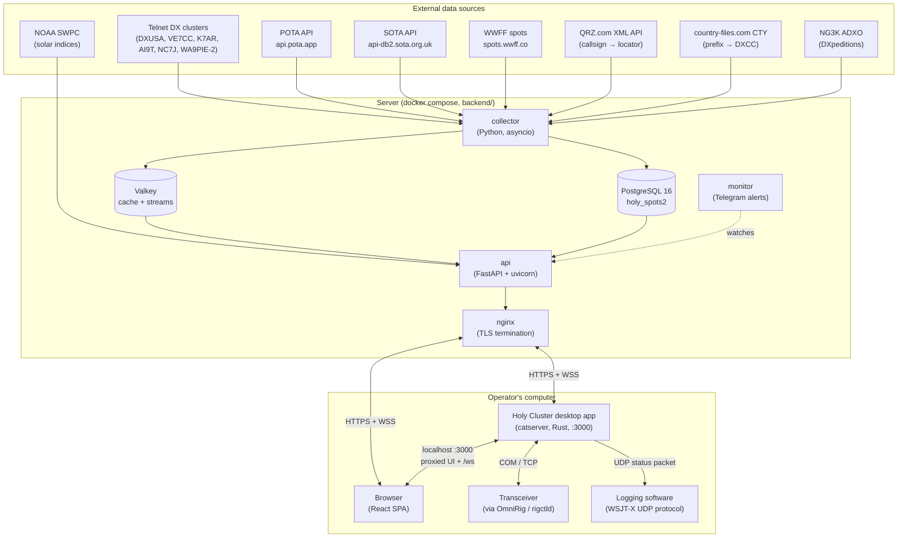

Two usage modes matter:

1. **Plain web usage** — the browser talks to `https://holycluster.iarc.org` directly. Spots stream in over WebSocket; radio control is unavailable.
2. **With the desktop app** — the user runs the catserver, which opens `http://127.0.0.1:3000` in their browser. The catserver **reverse-proxies the whole remote site** and additionally intercepts radio messages on the WebSocket, so the same web UI gains the ability to tune the local radio. (See [§6.1](#61-the-reverse-proxy-trick).)

---

## 3. Repository Layout

```
HolyCluster/
├── backend/            # Python uv workspace + docker compose stack (the server)
│   ├── api/            #   FastAPI web/WebSocket server
│   ├── collectors/     #   Spot ingestion pipeline
│   ├── monitor/        #   Health checks + Telegram alerts
│   ├── shared/         #   DB models, geo/QRZ/CTY, settings (Python package)
│   ├── migrations/     #   Alembic migrations
│   ├── docker/         #   Dockerfiles for api/collector/monitor/migrate
│   ├── infra/          #   nginx, postgres, valkey, certbot configs (AUTHORITATIVE)
│   ├── docker-compose.yml
│   ├── deploy.sh       #   Incremental deploy script (run by CI on the server)
│   └── setup.sh        #   First-time TLS bootstrap
├── ui/                 # React 18 + Vite SPA
│   ├── src/components/ #   UI components (CanvasMap/ is the map engine)
│   ├── src/hooks/      #   Context providers + data hooks
│   ├── src/data/       #   Static reference data (bands, DXCC, zones…)
│   ├── src/maps/       #   GeoJSON files
│   └── tests/          #   Vitest tests
├── catserver/          # Rust desktop CAT-control app (Windows MSI)
│   ├── src/            #   axum server + rig backends
│   └── wix/            #   MSI installer definition
├── shared/             # band_plans.json — single source of band data for backend AND ui
├── docs/               # User manual, runbooks, this document
├── .github/workflows/  # backend.yml, ui.yml, catserver.yml
├── nginx/, certbot/, postgres/, nginx-ui/   # ⚠ UNTRACKED local scratch (see gotchas)
└── README.md           # ⚠ Partially stale (references removed ClientSideServer.py)
```

Key cross-cutting file: **`shared/band_plans.json`** — band edges and mode segments. The backend collector consumes it via a docker build context (`band_plans=../shared`); the UI imports it at build time with a relative path (`ui/src/data/band_plans.js`). Both sides must agree on band definitions, so this is the single source of truth. Moving it breaks both consumers.

---

## 4. The Backend (`backend/`)

### 4.1 Workspace packages

The backend is a **uv workspace** (Python ≥ 3.13) with four member packages:

| Package | Path | Entry point | Role |
|---|---|---|---|
| `api` | `backend/api/` | `uvicorn api.main:app` (port 8000) | HTTP + WebSocket server, serves the SPA and the MSI |
| `collectors` | `backend/collectors/` | `collector` script | Ingest, enrich, dedupe, persist spots |
| `monitor` | `backend/monitor/` | `monitor` script | Synthetic checks + Telegram alerts |
| `shared` | `backend/shared/` | `ensure_db` script | SQLModel models, geo/QRZ/CTY logic, pydantic settings |

Everything runs from `docker compose up` in `backend/` (see [§7.1](#71-docker-compose-stack)). Lint is Ruff (line length 120). Tests exist under `api/tests/` and `collectors/tests/` but are **not currently run in CI**.

### 4.2 The spot collection pipeline

The collector (`collectors/src/collectors/main.py`) runs all sources as asyncio tasks feeding one `asyncio.Queue(maxsize=1000)`; a single consumer (`process_spots`) enriches and persists.

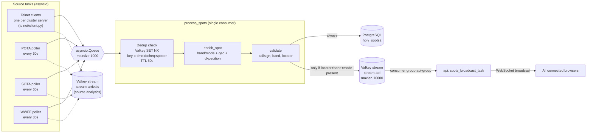

Source details:

- **Telnet clusters** (`collectors/telnet/`): server list in `telnet_servers.csv` (DXUSA, WA9PIE-2, VE7CC, K7AR, AI9T, NC7J active). One task per server, exponential reconnect backoff (60 s → 24 h cap), regex line parsing, 60 s read timeout triggers a `help\n` keepalive. Login uses `USERNAME_FOR_TELNET_CLUSTERS`. Spotters `W3LPL` and `J9AQ` are hardcoded-banned (`client.py:132`).
- **POTA / SOTA / WWFF** (`pota.py`, `sota.py`, `wwff.py`): JSON pollers sharing `utils.run_json_spot_collector`, which handles dedup, arrival recording, and error backoff (capped at 300 s).

There is **no RBN or DXHeat collector** — the telnet clusters are the live feed.

### 4.3 Spot enrichment

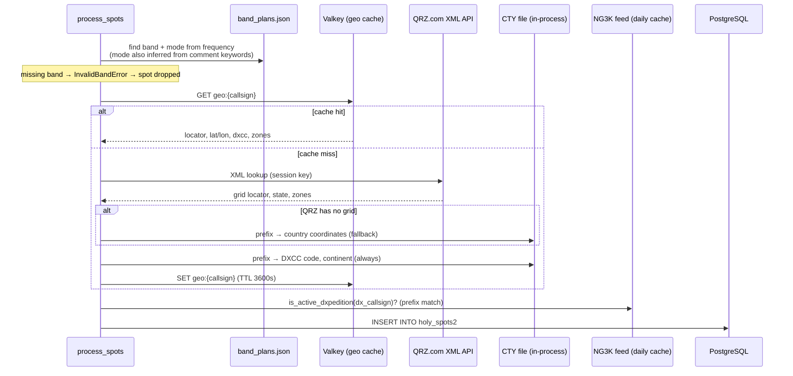

Notes:

- Both `spotter_callsign` and `dx_callsign` are geolocated (spot arcs need both endpoints).
- A hardcoded override table for ~25 special callsigns/prefixes lives in `shared/src/shared/geo.py:33-60` — this is where you add fixes per the [`fix_missing_spot.md`](fix_missing_spot.md) runbook.
- Spots resolving to the `AA00` (South Pole junk) locator are dropped.
- The QRZ session key is refreshed hourly by the collector and stored in Valkey; the API's `/locator/{callsign}` endpoint depends on it and returns 503 if missing.

### 4.4 Database schema

PostgreSQL 16, accessed via **SQLModel** (SQLAlchemy 2.x) with **asyncpg**. Migrations via async Alembic (`backend/migrations/`); the one-shot `migrate` compose service runs `ensure_db && alembic upgrade head`.

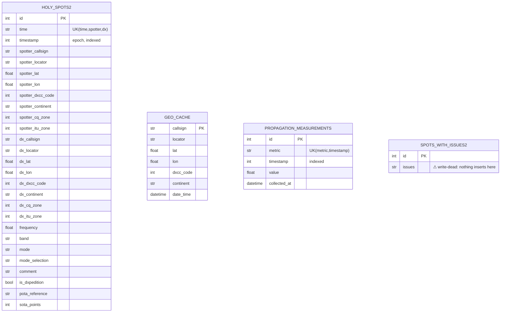

Naming note: table names carry a `2` suffix (`holy_spots2`, `spots_with_issues2`) — an artifact of a past schema migration.

⚠ **Two known data-lifecycle defects** (details in [IMPROVEMENTS.md](IMPROVEMENTS.md) #1):
- `cleanup_postgres_tables.py` filters `HolySpot.date_time`, a column that doesn't exist — retention cleanup of the main spots table is broken.
- Nothing writes to `spots_with_issues2`, yet the `fix_missing_spot.md` runbook and the `/spots_with_issues` endpoint assume it's populated.

### 4.5 The API service

FastAPI app (`api/src/api/main.py`, ~1100 lines) with GZip middleware and OpenAPI docs disabled. Startup lifespan opens the Valkey client and shared httpx client, ensures the CTY file, and spawns the propagation collector + spots broadcaster tasks. **It also serves the React SPA** (static `/assets` mount + `index.html` catch-all) and the catserver MSI — nginx in front is a pure TLS proxy.

| Method | Path | Purpose |
|---|---|---|
| GET | `/locator/{callsign}` | Callsign → locator/lat/lon (needs QRZ session; 503 if absent) |
| GET | `/geocache/all`, `/geocache/{callsign}` | Geo cache dump / single record (⚠ `/all` is unbounded) |
| GET | `/spots_with_issues` | Dump of `spots_with_issues2` (currently always empty) |
| GET | `/propagation` | Latest solar indices (from memory) |
| GET | `/propagation/history?start_time&end_time` | Index time-series (max 24 h window) |
| GET | `/voacap?...` | VOACAP HF propagation grid (CPU-heavy, run in thread) |
| GET | `/dxpeditions` | Active DXpeditions (from Valkey) |
| GET | `/history?start_time&end_time` | Historical spots (max 24 h window) |
| GET | `/cluster_stats?hours` | Source-overlap analytics from `stream-arrivals` |
| GET | `/catserver/latest`, `/catserver/download` | Desktop app version + MSI download |
| GET | `/health` | Liveness (used by compose healthcheck) |
| GET | `/`, `/{path}` | SPA `index.html` catch-all |
| WS | `/ws` | **Primary versioned protocol** (see below) |
| WS | `/spots_ws`, `/submit_spot`, `/radio` | ⚠ Legacy endpoints, still live |

### 4.6 WebSocket protocol

One multiplexed socket, protocol version 1. Every message is JSON with `{"version": 1, "type": ...}`.

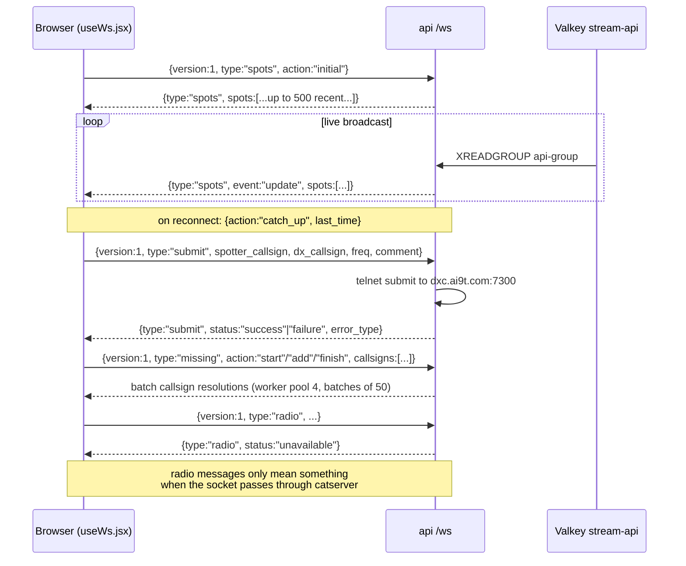

The `radio` type is the interesting one: the backend always answers `unavailable`. When the user runs the desktop app, the **catserver sits between browser and backend** on this same socket and *intercepts* radio messages locally instead of forwarding them ([§6.3](#63-radio-control-message-flow)).

### 4.7 Background jobs

| Where | Job | Interval |
|---|---|---|
| collector | QRZ session key refresh | 1 h |
| collector | NG3K DXpedition list refresh | 24 h (retry 10 min) |
| collector | `trim_arrivals_stream` (7-day retention) | 1 h |
| collector | POTA / SOTA / WWFF pollers | 60 / 60 / 30 s |
| api | NOAA propagation fetch + persist | 1 h (retry 10 s) |
| api | `spots_broadcast_task` (stream consumer) | continuous |
| monitor | metric/heartbeat/WS/container checks | 60 s |
| external | `cleanup_postgres` retention job | not in compose — external cron (⚠ and currently buggy) |

### 4.8 Configuration

All settings are **pydantic-settings** classes in `backend/shared/src/shared/settings.py`, reading `backend/.env`. A `Path("/.dockerenv").exists()` check auto-selects docker-internal vs localhost hosts/ports, so the same `.env` works inside and outside containers. Key variables (see `.env.example`): `POSTGRES_*`, `VALKEY_*` (incl. `VALKEY_GEO_EXPIRATION=3600`, `VALKEY_SPOT_EXPIRATION=60`), `QRZ_USER/PASSWORD/API_KEY`, `USERNAME_FOR_TELNET_CLUSTERS`, `UI_DIST_PATH`, `CATSERVER_MSI_DIR`, `LOG_DIR`, `DOMAIN`, `EMAIL`, monitor's `TELEGRAM_BOT_TOKEN/CHAT_ID`, `POSTGRES_DB_RETENTION_DAYS=14`.

---

## 5. The Frontend (`ui/`)

### 5.1 Tech stack and entry flow

React 18 (JSX, no TypeScript) + Vite 6 + Tailwind 3.4. Formatter/linter is **Biome** (4-space indent). Tests are **Vitest** + Testing Library. The map is **HTML5 Canvas + d3-geo** (not Leaflet). Notable deps: `react-use-websocket`, `solar-calculator` (day/night terminator), `maidenhead`, `idb` (IndexedDB), `adif-parser-ts`, `react-joyride` (tour), `@dnd-kit` (band reordering).

In dev, `vite.config.js` proxies all API/WS routes to `holycluster-dev.iarc.org`, so `npm run dev` works without a local backend. A custom Vite plugin generates DXCC entity data at build time from CTY data.

### 5.2 State management — the provider tree

All global state is React Context — no Redux. **`ProfilesProvider` is the backbone**: nearly every persistent setting is a section of the "active profile" stored in localStorage.

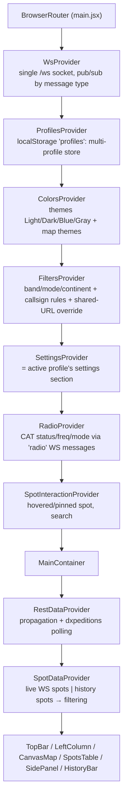

⚠ Ordering is load-bearing: `SettingsProvider`, `FiltersProvider`, `ColorsProvider` all read from `ProfilesProvider` and throw if mounted outside it.

Profile sections (defined in `utils/profile_data.js`): `settings`, `filters`, `callsign_filters`, `missing`, `map_controls`, `map_view`, `table_sort`, `history`, `panels`, `radio`.

### 5.3 Data flow into the UI

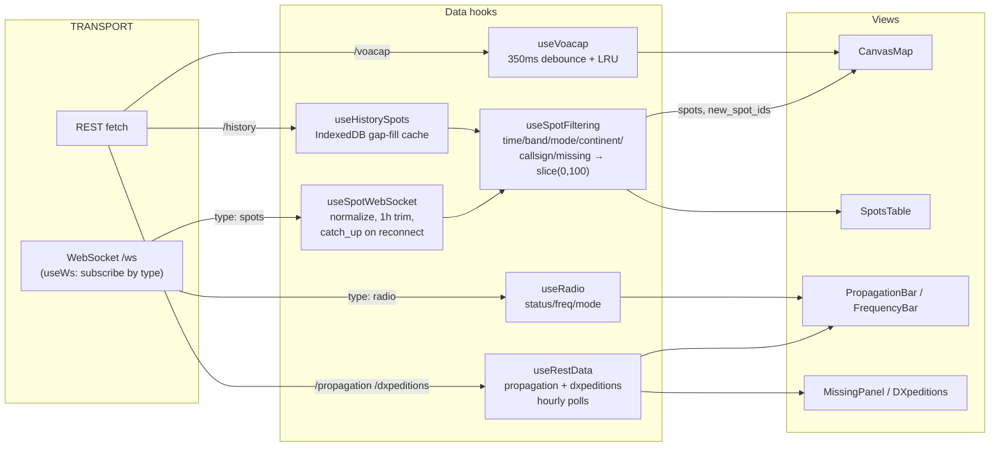

Silent data limits worth knowing: live spots are trimmed to the **last hour**, and the filtered list is capped at **100 spots** (`useSpotFiltering.js`). Alerted spots bypass most filters. Messages sent while the socket isn't OPEN are silently dropped (`useWs.jsx:60`).

### 5.4 The canvas map engine

`components/CanvasMap/` renders with **four stacked canvases** and d3-geo projections — azimuthal equidistant ("radar" view centered on the user) or orthographic (globe):

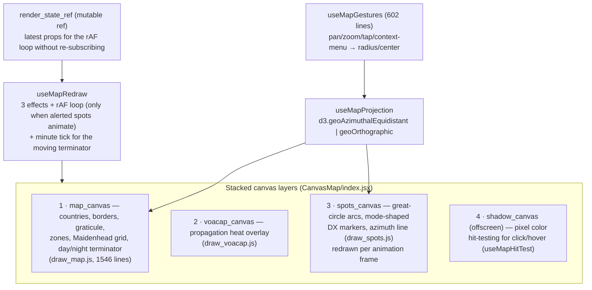

The day/night terminator computes the solar antipode with `solar-calculator` and draws a 90°-radius `d3.geoCircle` at 30% alpha; a minute-tick effect keeps it moving. The `render_state_ref` pattern deliberately bypasses React re-renders for the animation loop — treat it carefully (stale-closure territory).

### 5.5 Persistence — profiles in localStorage

- **`"profiles"`** — the entire multi-profile store; every settings write re-serializes and sanitizes it. Legacy standalone keys are migrated on first load.
- **IndexedDB** (`utils/spot_cache_db.js`) — history-spot interval cache with gap-fill and idle-time eviction every 3 h.
- **URL param** — filters can be shared as links; a shared filter temporarily overrides profile filters until saved.
- Misc keys: `"colors"` + `"dev_mode"` (dev-mode theme editor), `"active_view"`, `"mobile_tab"`, `"first_launch"`, `"last_release"`, tour-completion.

There is **no server-side account or sync** — profiles are exported/imported as JSON files in Settings.

### 5.6 Major features map

| Feature | Key files | Notes |
|---|---|---|
| Spots table | `SpotsTable.jsx` (908 lines) | Sortable, row click tunes radio, context menu adds filters |
| Filters | `useFilters.jsx`, `FilterModal.jsx` | Bands/modes/continents/callsign rules; shareable URLs; 3-state zone cycle |
| Settings | `settings/Settings.jsx` + tabs | temp-copy edit, committed on save |
| Missing panel | `MissingPanel.jsx` (729 lines), `missing_adif*` | ADIF import in a Web Worker (50 MB limit); flags "needed" spots |
| DXpeditions | `DXpeditions.jsx` | From NG3K via backend |
| Propagation | `PropagationBar.jsx` | SFI / A / K indices |
| VOACAP overlay | `useVoacap.jsx`, `draw_voacap.js` | ⚠ dev-mode gated |
| History playback | `history/HistoryBar.jsx` | ⚠ dev-mode gated |
| Guided tour | `tour/` (react-joyride) | Targets `data-tour` attributes |
| Radio CAT | `useRadio.jsx` | Version-gated features by parsed catserver version |
| Submit spot | `SubmitSpot.jsx` | Via shared `/ws`; contains a dead legacy socket path |

---

## 6. The CAT Server (`catserver/`)

A small Rust desktop app (product name **"Holy Cluster"**, `HolyCluster.exe`) that operators install on Windows. It bridges the *remote* web UI to the *local* radio.

### 6.1 The reverse-proxy trick

A page served from `https://holycluster.iarc.org` cannot open a WebSocket to `ws://localhost` hardware bridges reliably (mixed content, certificates). The catserver solves this by **serving the whole site itself**:

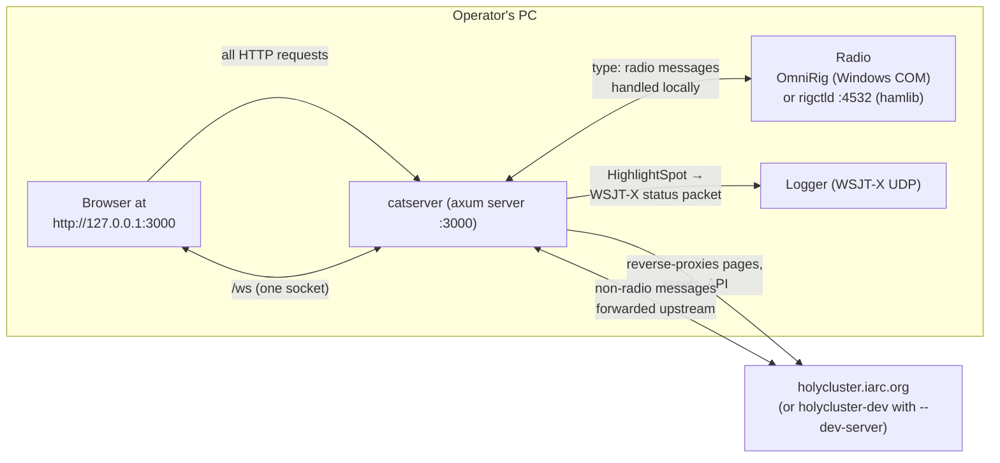

On launch, `main.rs` opens the default browser at `http://127.0.0.1:3000`. Every HTTP request is proxied to the remote site — except the `/ws` WebSocket, where catserver splits traffic: messages with `version==1 && type=="radio"` are handled locally against the rig; everything else is forwarded to the real backend. The UI therefore needs no special "local mode" — the same `radio` messages that the plain backend answers with `unavailable` suddenly start working.

A single-instance guard makes a second launch POST `/open` to the already-running instance instead of starting again. `--local-ui` serves a local `ui/dist` instead of proxying (frontend dev against a real radio).

### 6.2 Modules and rig backends

| Module | Role |
|---|---|
| `main.rs` | Arg parsing, single-instance guard, backend selection, tray icon spawn |
| `server.rs` | axum HTTP/WS server on `0.0.0.0:3000`, proxy, radio command loop |
| `rig.rs` | `Radio` trait + thread-safe `AnyRadio` wrapper (with lock-poison recovery) |
| `omnirig.rs` | **Windows**: OmniRig via COM/IDispatch (winsafe) |
| `rigctld.rs` | **non-Windows**: TCP text protocol to hamlib `rigctld` at `localhost:4532` |
| `dummy.rs` | Fake radio (`--dummy`) for development |
| `freq.rs` | `Freq` newtype (hertz as `u32`) |
| `tray_icon.rs` | Windows system-tray icon (Open / Quit) |
| `reporting.rs` | WSJT-X-compatible UDP status packet for logger integration |
| `utils.rs` | axum ↔ tungstenite WS message conversion |

Backend selection is compile-time by OS (`#[cfg(windows)]` → OmniRig, else rigctld), with `--dummy` as a runtime override. Both real backends auto-reinit after 5 consecutive failures. If OmniRig isn't installed, the app opens the site's `/omnirig-error` page and exits.

### 6.3 Radio control message flow

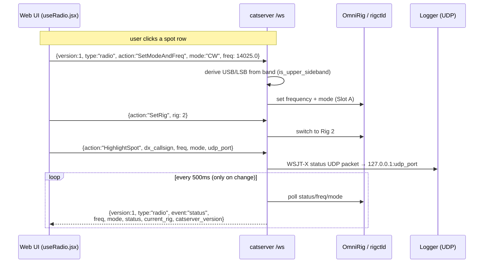

The `catserver_version` in status messages powers the UI's update nudge: the UI fetches `/catserver/latest` from the backend and compares — if the served MSI is newer, it shows "new version available".

### 6.4 Packaging and distribution

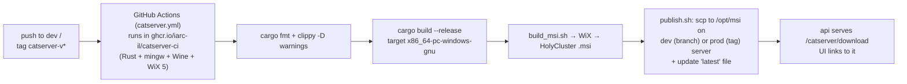

Notables: the Windows MSI is cross-built **on Linux** (mingw + Wine + WiX 5.0.2). `build.rs` derives the version from `git describe --match catserver-v*` and **panics if no such tag is reachable** — shallow clones without tags fail to build. Dev builds bake `--dev-server` into the shortcut so they point at the dev site.

---

## 7. Infrastructure & Deployment

### 7.1 Docker Compose stack

Single compose file: `backend/docker-compose.yml`. Default bridge network; services address each other by name. Env from `backend/.env`.

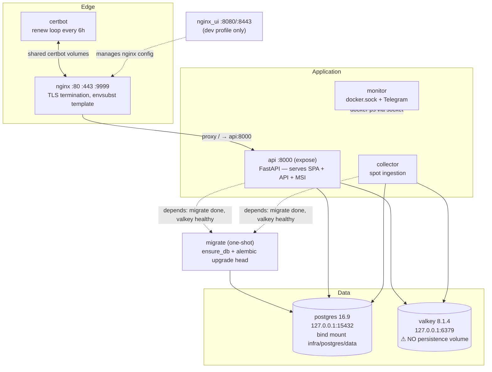

Mounted from the host into `api`: the UI dist (`${UI_DIST_PATH}`, rsynced by CI), the MSI dir (`${CATSERVER_MSI_DIR}`, scp'd by CI), and logs. The `monitor` and `nginx_ui` containers mount `/var/run/docker.sock` (effectively root-on-host — known tradeoff).

### 7.2 Nginx routing and TLS

The **authoritative config is `backend/infra/nginx/nginx.conf.template`** — rendered at container start with `envsubst '${DOMAIN}'`. (The committed `nginx.conf` next to it is a stale render; editing it does nothing.)

Server blocks: `:80` → ACME challenge + redirect to HTTPS; `:443` → proxy everything to `api:8000` with WebSocket upgrade headers; `:9999` → nginx-ui admin (proxy commented out in the template); `:3000` → passthrough to the docker host (Grafana lives on the host).

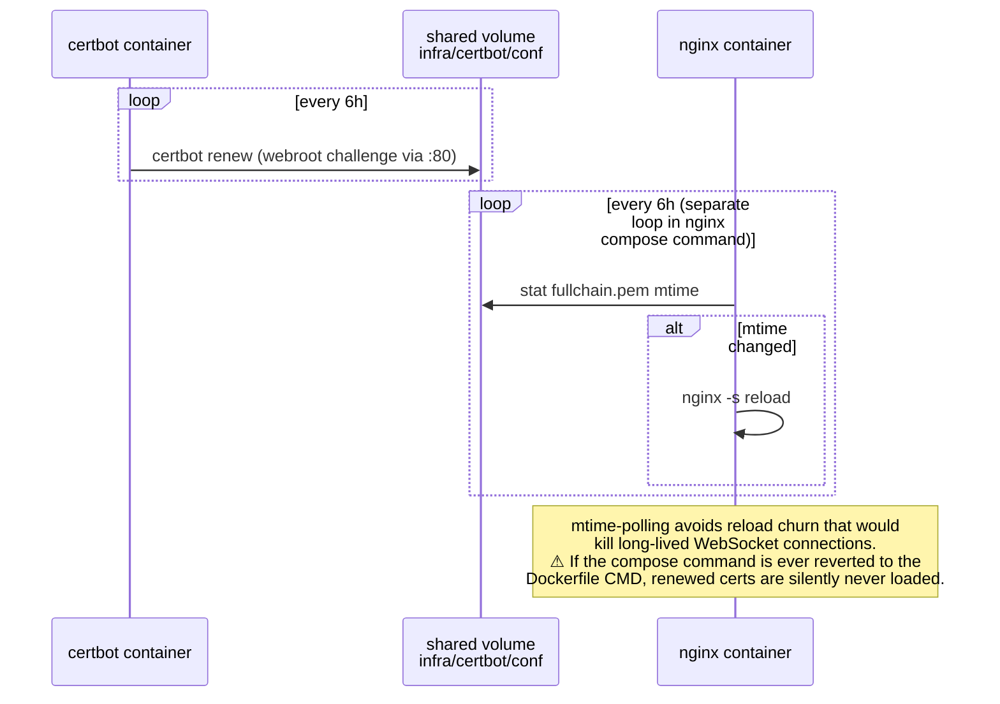

First-time issuance is manual via `backend/setup.sh` (temporary self-signed cert → start stack → real `certbot certonly` → reload).

### 7.3 CI/CD pipelines

All three workflows deploy over SSH: pushes to `dev` → dev server; version tags → prod server.

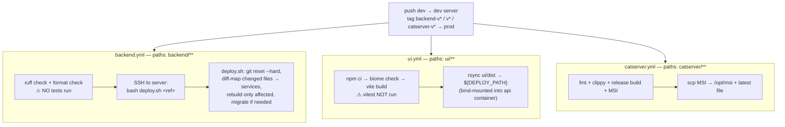

`deploy.sh` is the clever part: it diffs the incoming ref against the current HEAD, maps changed paths to compose services (e.g. `api/**` → api, `shared/**` → everything + migrations), stops `monitor` first to avoid alert flapping, rebuilds only what changed, and restarts nginx last. It also `git reset --hard`s the server working tree — never hand-edit on the server.

### 7.4 Production topology

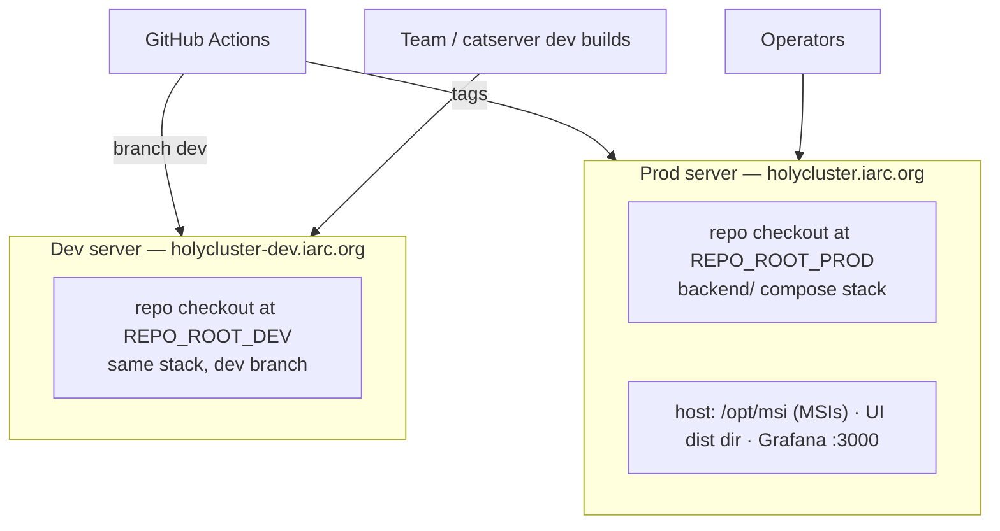

The UI dev proxy and catserver `--dev-server` flag both target the dev domain, so frontend and desktop development run against live dev data.

---

## 8. Development Workflow

**Frontend** (no local backend needed — proxies to dev server):
```bash
cd ui
npm install
npm run dev        # Vite dev server, proxies API/WS to holycluster-dev.iarc.org
npm run check      # biome + vitest
```

**Backend** (full stack):
```bash
cd backend
cp .env.example .env   # fill in secrets (QRZ creds, telnet username, paths)
docker compose up      # postgres, valkey, migrate, collector, api, monitor, nginx
# API on http://localhost:8000 (through compose), postgres on 127.0.0.1:15432
uv run pytest          # run package tests (pytest not in deps — use uvx pytest if needed)
```

**Catserver** (on any OS with a dummy radio):
```bash
cd catserver
cargo run -- --dummy            # local server :3000, fake radio
cargo run -- --dummy --local-ui # serve local ui/dist instead of proxying
```
Note: a full build needs a reachable `catserver-v*` git tag (`git fetch --tags`), or `build.rs` panics.

**Releases:** merge to `dev` → auto-deploy to dev server. Tag `backend-vX`, `vX` (UI), or `catserver-vX` → deploy to prod.

---

## 9. Maintainer Gotchas

The condensed list of things most likely to bite you — the top items are expanded into the prioritized backlog in [IMPROVEMENTS.md](IMPROVEMENTS.md).

1. **Retention cleanup is broken** — `cleanup_postgres_tables.py` references a nonexistent `HolySpot.date_time`; `holy_spots2` grows unbounded.
2. **The `fix_missing_spot.md` runbook is partly obsolete** — nothing writes to `spots_with_issues2` anymore.
3. **CI runs zero tests** — backend pytest suites and UI vitest suites exist but only linters gate deploys.
4. **Valkey has no persistence** — restart loses geo cache, dedup keys, streams, and the QRZ session key (API `/locator` 503s until the collector refreshes it).
5. **Edit `nginx.conf.template`, not `nginx.conf`** — only the template is rendered at runtime.
6. **Legacy protocol duplication** — `/spots_ws`, `/submit_spot`, `/radio` (backend), `/radio` + dual message enums (catserver), dead submit path (UI) all still exist alongside the v1 `/ws` protocol; both broadcast sets must be kept in sync.
7. **catserver binds `0.0.0.0:3000`** — the local bridge (and radio control) is reachable from the LAN.
8. **QRZ password goes into a URL query string** (`shared/qrz.py`) — shows up wherever URLs are logged.
9. **Untracked shadow trees** at repo root (`nginx/`, `certbot/`, `postgres/`, `nginx-ui/`) are local scratch; the authoritative infra lives in `backend/infra/`. Live PGDATA sits inside the repo tree as a bind mount.
10. **Stale README** — `ClientSideServer.py` and the pip install flow no longer exist; the Rust catserver replaced them.
11. **Timezone mix** — `HolySpot.time` derives from local time (containers pin `TZ=Asia/Jerusalem`) while `timestamp` is epoch; be careful comparing.
12. **Frontend hot spots** — `draw_map.js` (1546 lines), `SpotsTable.jsx` (908), `MapControls.jsx` (774), `useMapGestures.js` (602) carry most of the complexity and little test coverage; the canvas rAF loop reads a mutable `render_state_ref` outside React's model.
13. **Silent UI limits** — spots trimmed to 1 hour and capped at 100 after filtering; WS sends dropped when the socket isn't open; VOACAP and history playback are dev-mode gated.
14. **Version-gated features** — spot highlight (UDP) only fires when catserver version > 1.1.0.0; version parsing is regex-based on git-describe output.
