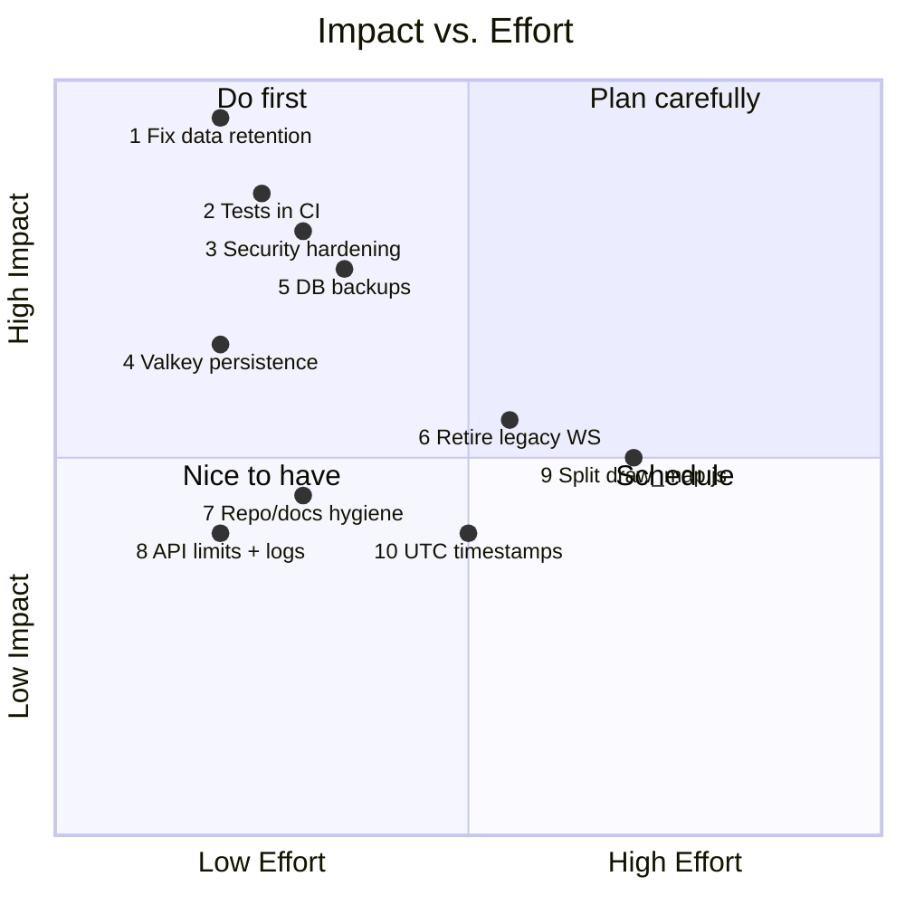
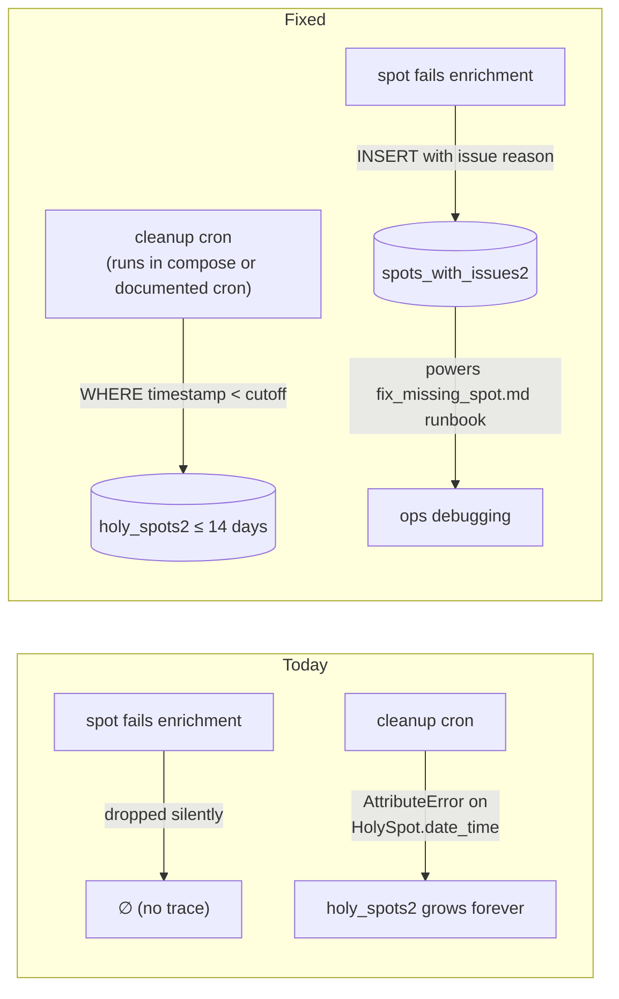
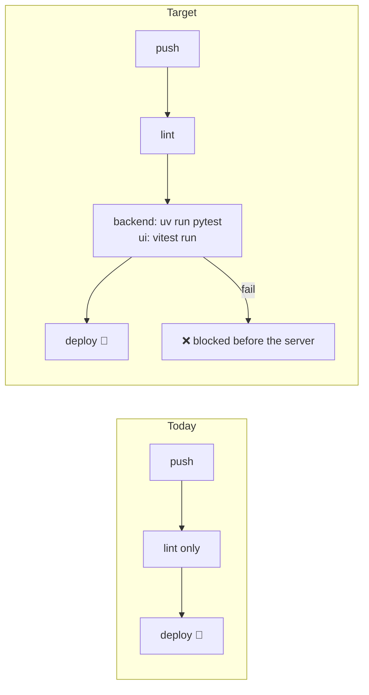
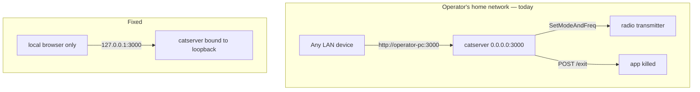
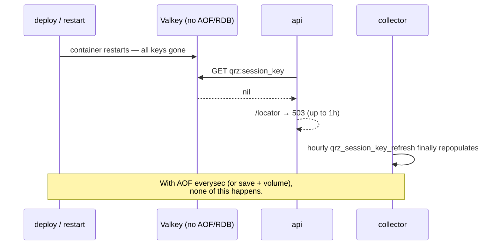
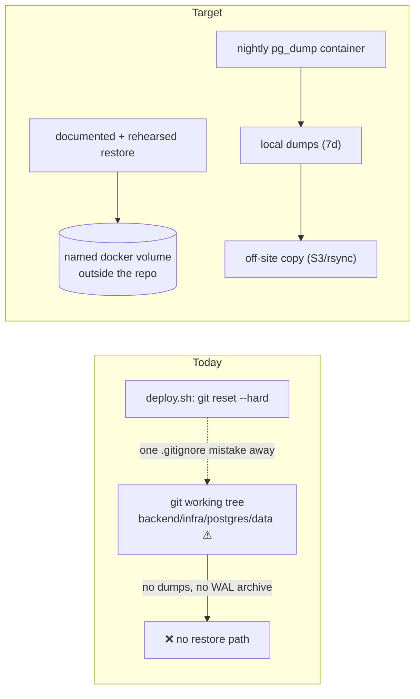
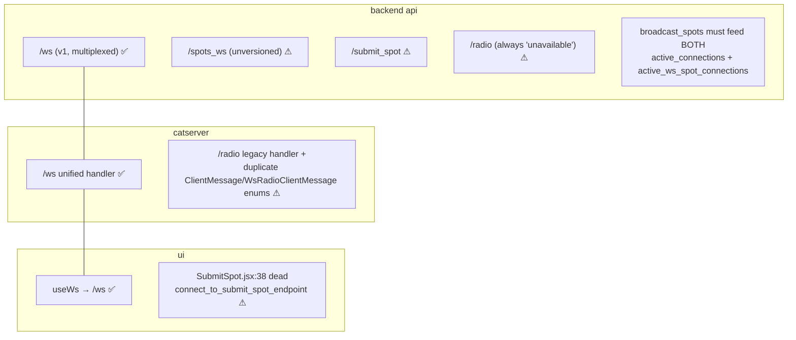
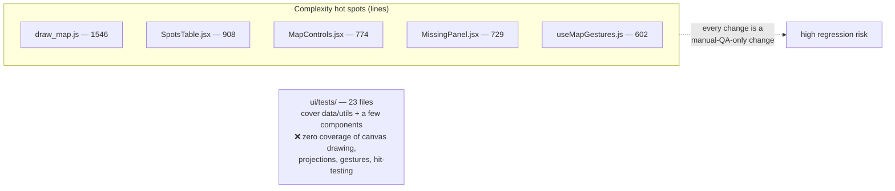

# HolyCluster — Improvement Backlog

> Ten improvements, **ordered by importance**, based on a full-repo architecture review (see [`ARCHITECTURE.md`](ARCHITECTURE.md)).
> Companion file: [`improvements.html`](improvements.html) (same content, rendered diagrams).
>
> Every finding below was verified against the code; file/line references point at the evidence.

## Priority Overview

| # | Improvement | Category | Effort | Risk if ignored |
|---|---|---|---|---|
| 1 | Fix broken data-retention & issues-table pipeline | Data integrity | S | Unbounded DB growth; broken ops runbook |
| 2 | Run the existing test suites in CI | Quality gate | S | Regressions ship straight to prod |
| 3 | Security hardening (catserver bind, QRZ creds) | Security | S–M | LAN radio takeover; credential leak via logs |
| 4 | Enable Valkey persistence & graceful degradation | Resilience | S | Feature outages after every restart |
| 5 | Automated PostgreSQL backups (+ move PGDATA) | Disaster recovery | M | Total data loss is one `rm -rf` away |
| 6 | Retire the legacy WebSocket protocols | Simplification | M | Dual code paths drift; double maintenance |
| 7 | Repository & documentation hygiene | Onboarding | S | New engineers follow stale README into dead ends |
| 8 | Bound the unbounded API endpoints, drop debug logs | Robustness | S | Memory spikes; noisy logs |
| 9 | Break up the frontend monoliths, test the map | Maintainability | L | Map changes stay high-risk and untestable |
| 10 | Unify timestamps on UTC | Correctness | M | Subtle time-window bugs, DST edge cases |

Effort: S = hours, M = days, L = week+.

---

## 1. Fix the broken data-retention & issues-table pipeline

**Category: data integrity · Effort: S · The only known *actively broken* production defect.**

Two related failures in the spot data lifecycle:

- **The retention job crashes on the main table.** `backend/collectors/src/collectors/db/cleanup_postgres_tables.py:40` deletes rows `where(model.date_time < cutoff)` for both models, but `HolySpot` has no `date_time` column (only `time` and `timestamp` — `backend/shared/src/shared/db.py:35-72`). Cleanup of `holy_spots2` raises `AttributeError`, so the intended 14-day retention (`POSTGRES_DB_RETENTION_DAYS`) never happens and the table grows without bound. The job isn't in docker-compose either — confirm the external cron actually exists on both servers.
- **The issues table is write-dead.** The `fix_missing_spot.md` runbook and the `/spots_with_issues` endpoint both assume `spots_with_issues2` is populated, but no code inserts into it — the collector silently drops problematic spots (`collectors/main.py:178-207`). The team's own debugging procedure no longer works.

**Do:** (a) filter on `HolySpot.timestamp` (epoch int) instead of `date_time`; (b) re-add the insert into `SpotsWithIssues` where enrichment fails, with the failure reason; (c) schedule `cleanup_postgres` explicitly (a compose service with a loop, or a documented cron) and add a test for it; (d) update `fix_missing_spot.md` to match reality.

---

## 2. Run the existing test suites in CI

**Category: quality gate · Effort: S · Highest leverage-per-hour in the repo.**

Both test suites already exist — CI just never runs them. A push to `dev` **deploys to the dev server** having only passed linters; a tag deploys to prod the same way.

- `backend.yml` runs only `ruff check` + `ruff format --check`; the pytest suites in `backend/api/tests/` (WebSocket protocol, VOACAP, propagation) and `backend/collectors/tests/` (parsers, enrichers, geo) are skipped. `pytest` isn't even a declared dev dependency.
- `ui.yml` runs `biome check` + `vite build`, but not `vitest` — despite 23 test files in `ui/tests/` and an existing `npm run check` script that does exactly lint+test.

**Do:** add `pytest` (+ `pytest-asyncio`) to the backend dev dependencies and a `uv run pytest` step to `backend.yml`; change `ui.yml` to `npm run check` (or add `npx vitest run`). Then grow coverage where it hurts most: the collector enrichment path and the `/ws` protocol.

---

## 3. Security hardening — catserver bind address & QRZ credentials

**Category: security · Effort: S–M.**

Three independent findings, ordered by severity:

1. **catserver listens on `0.0.0.0:3000`** (`catserver/src/server.rs:119`), not `127.0.0.1`. Anyone on the operator's LAN (or a hostile Wi-Fi network) can open the proxied UI, drive the WebSocket, and **transmit-tune the user's radio** — and reach the `/exit` endpoint to kill the app. The design only ever needs localhost (the browser it launches is local).
2. **The QRZ password travels in a URL query string** (`backend/shared/src/shared/qrz.py:93`). Query strings end up in HTTP client logs, proxies, and exception traces. QRZ's XML API accepts POST form data; at minimum, make sure the URL never reaches a logger.
3. **Docker socket mounts** (`monitor`, `nginx_ui` services) are root-on-host equivalents. `nginx_ui` is dev-profile-only — good — but `monitor` runs in prod; consider a socket proxy (e.g. read-only `docker ps` filtering) or at least document the tradeoff.

**Do:** bind `127.0.0.1` (keep an opt-in `--bind` flag for the rare remote-desktop setup); move QRZ auth out of the query string or guarantee URL redaction in logs; review docker-socket exposure. Also note `nginx-ui/app.ini` holds plaintext secrets in the working tree (gitignored, but visible to anyone with tree access).

---

## 4. Enable Valkey persistence & graceful degradation

**Category: resilience · Effort: S.**

The Valkey service has its persistence volume **commented out** (`backend/docker-compose.yml:32-34`). Every restart (deploy, crash, host reboot) loses:

| Lost state | Consequence |
|---|---|
| `qrz:session_key` | `/locator` returns **503** until the collector's hourly refresh runs |
| geo cache | QRZ hammered with re-lookups; slower enrichment for up to 1 h |
| dedup keys | brief duplicate-spot window across sources |
| `stream-api` + consumer group | broadcast gap; clients rely on `catch_up` |
| `dxpeditions:active` | `/dxpeditions` empty until the daily refresh |

**Do:** uncomment the data volume and enable `appendonly yes` (AOF everysec) in `infra/valkey/`; independently, make the API request a QRZ session itself when the key is missing instead of 503-ing until the collector's next cycle.

---

## 5. Automated PostgreSQL backups — and move PGDATA out of the repo tree

**Category: disaster recovery · Effort: M.**

There is **no backup mechanism anywhere in the repo**, and the live database files sit *inside the git working tree* as a bind mount (`backend/infra/postgres/data/`). The deploy script runs `git reset --hard` in that same tree on every deploy; gitignore is the only thing separating a routine deploy from data loss. `docs/fix_missing_spot.md` even documents `TRUNCATE TABLE geo_cache;` as a casual ops step — with no restore path if the wrong table is truncated.

**Do:** add a nightly `pg_dump` sidecar (or host cron) with rotation and an off-site copy; move PGDATA to a named volume or a path outside the repo; write a short `docs/restore.md` and actually rehearse it once. Postgres is the only stateful store that can't be regenerated — spots history is irreplaceable.

---

## 6. Retire the legacy WebSocket protocols

**Category: simplification · Effort: M (needs a client-usage measurement first).**

The versioned `/ws` protocol (v1) replaced older endpoints, but the old ones were never removed. Today **four parallel paths** exist across three codebases:

Every spots broadcast is duplicated to two connection sets (`api/main.py:110-115`); catserver maintains two near-identical command enums (`server.rs:568-629`); the UI ships dead socket code and the Vite proxy still routes three legacy WS paths. Old catserver installations are the main reason the legacy endpoints survive — which is exactly why the catserver auto-update nudge matters.

**Do:** log per-endpoint connection counts for a few weeks; then delete the UI dead path (free), remove catserver's `/radio` handler and duplicate enum, and finally remove the backend legacy endpoints (or return a "please update" close code). End state: one protocol, one broadcast set, one enum.

---

## 7. Repository & documentation hygiene

**Category: onboarding · Effort: S.**

Individually small, collectively the first impression every new engineer gets:

- **README is wrong.** It instructs `pip install -e '.[omnirig]'` and `python src/ClientSideServer.py` (`README.md:53,58`) — neither exists; the Rust catserver replaced them, and the backend moved to `uv` + docker compose long ago.
- **~120 MB of log files at repo root** (`compose_logs_int_3.txt` 41 MB, `compose_logs_int_4.txt` 79 MB) — untracked but not gitignored, so they pollute `git status` forever.
- **Shadow infra trees** at the root (`nginx/`, `certbot/`, `postgres/`, `nginx-ui/`) shadow the authoritative `backend/infra/` — a classic edit-the-wrong-file trap.
- **`nginx.conf` vs `nginx.conf.template` drift**: only the template is rendered at runtime; the committed rendered copy differs (the :9999 `proxy_pass` line) and misleads.
- Minor: leftover `logger.info("test")` debug lines (see #8), the WiX installer writes its registry keypath under boilerplate `Software\MyCompany\MyApp` (`catserver/wix/main.wxs:122-124`), `publish.sh:22` `exit1` typo.

**Do:** rewrite the README around the three real components (a condensed version of `ARCHITECTURE.md` §8); delete the logs and gitignore `compose_logs*`; add a root-README note (or `.md` marker files) pointing from the shadow trees to `backend/infra/`; delete the stale rendered `nginx.conf` or regenerate it in CI; fix the WiX keypath.

---

## 8. Bound the unbounded API endpoints & remove debug leftovers

**Category: robustness · Effort: S.**

- `GET /geocache/all` (`api/main.py:594`) serializes the **entire** `geo_cache` table — tens of thousands of rows, no limit, no pagination — into memory per request. An accidental refresh-loop or a crawler can spike API memory/CPU.
- `GET /spots_with_issues` (`api/main.py:612`) is the same pattern (currently returns `[]` only because of defect #1 — fixing #1 makes this one unbounded too).
- `/history` contains leftover debug logging: `logger.info("test 1s")`, `logger.info("test")` (`api/main.py:1068,1071`).
- No rate limiting exists anywhere; nginx would be the natural place for a basic `limit_req` on the expensive endpoints (`/voacap`, `/history`).

**Do:** add `limit`/`offset` (with a sane default and max) to both dump endpoints — or restrict them to internal use; delete the debug lines; add a modest nginx `limit_req` zone for `/voacap` and `/history`.

---

## 9. Break up the frontend monoliths & test the map engine

**Category: maintainability · Effort: L.**

The map — the product's core — is concentrated in a handful of giant, effectively untested files:

`draw_map.js` alone contains country fills, adaptive Maidenhead grid + labels, CQ/ITU zones, DXCC strokes, the equator, and the day/night terminator. The animation loop reads a mutable `render_state_ref` outside React's model — correct today, but a stale-closure magnet for anyone editing `useMapRedraw.js`.

**Do (incrementally, not a rewrite):** split `draw_map.js` by layer (`draw_countries.js`, `draw_grid.js`, `draw_zones.js`, `draw_night.js`) — the seams already exist as top-level functions; extract the pure geometry/label-placement helpers and unit-test those (no canvas needed); add a couple of golden-image canvas tests (`vitest` + `canvas` npm package) for the main draw paths; document the `render_state_ref` contract in a comment block.

---

## 10. Unify timestamps on UTC

**Category: correctness · Effort: M (touches data, needs a migration note).**

Spot timestamps mix timezone bases: `add_spot_to_postgres` builds `HolySpot.time` with local-time `datetime.fromtimestamp(...)` while `timestamp` is a UTC epoch (`collectors/main.py:118`), and the containers pin `TZ=Asia/Jerusalem` (`docker-compose.yml`). Meanwhile the API's time-window queries (`/history`, `/propagation/history`) and the UI's 1-hour trim all reason in epoch/UTC.

Consequences: the string `time` column disagrees with `timestamp` by the server's UTC offset; DST transitions shift it twice a year; anyone comparing `time` against a UTC source (or running the stack with a different host TZ) gets subtly wrong windows — and the dedup key includes `time`, so the same spot arriving via a UTC-based source and a local-time path wouldn't collide.

**Do:** write UTC everywhere (`datetime.fromtimestamp(ts, tz=timezone.utc)`), treat epoch `timestamp` as the single source of truth and derive display strings client-side; keep `TZ` pinning only for log readability. Existing rows keep their meaning if you document the cutover date; a backfill is optional.

---

## Suggested sequencing

```mermaid
gantt
    dateFormat X
    axisFormat %s
    section Week 1 — stop the bleeding
        1 Retention fix           :a1, 0, 2
        2 Tests in CI             :a2, 0, 2
        4 Valkey persistence      :a3, 2, 3
        8 API limits + debug logs :a4, 2, 3
    section Week 2–3 — safety net
        3 Security hardening      :b1, 3, 5
        5 Backups + PGDATA move   :b2, 5, 8
        7 Repo/docs hygiene       :b3, 3, 5
    section Month 2 — structural
        6 Retire legacy WS        :c1, 8, 12
        10 UTC timestamps         :c2, 8, 11
        9 Frontend refactor       :c3, 11, 16
```

Items 1, 2, 4, and 8 are each a few hours of work and remove the most acute risks; do them first. Items 3, 5, 7 build the safety net. Items 6, 9, 10 are structural and benefit from the test gate (#2) landing before them.
