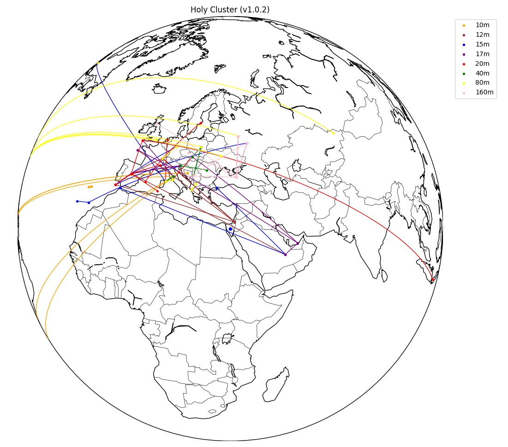
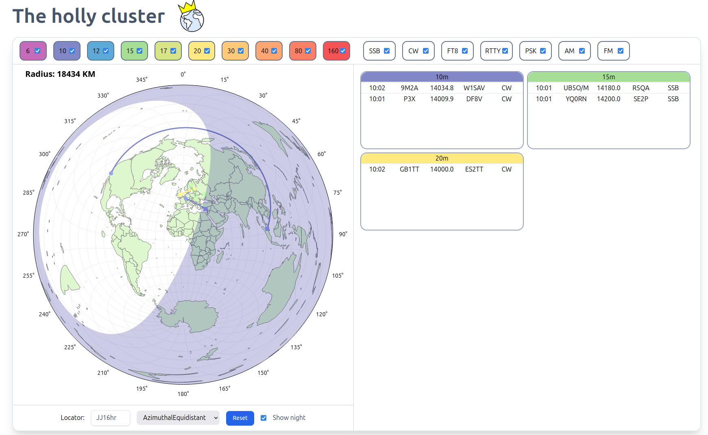
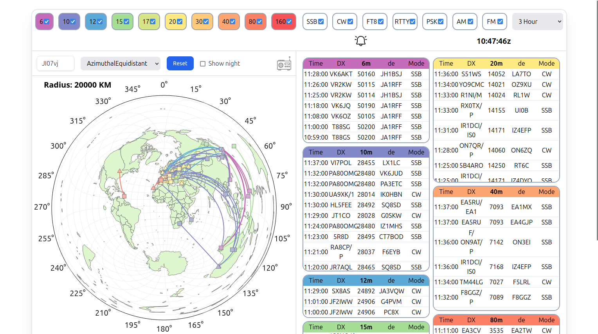

## The Holy Cluster
#### Friedrichshafen 2026

::: notes
Todo list before starting:
- Move to a clean desktop workspace
- Mute whatsapp and slack
- Open production
- Open local development server
- Start windows VM
- Check CAT control
:::
---

## Who am I?

- **Omer Sarig** (4X1XP)
- 28 years old
- Licensed since 2021
- Software developer

---

## What is a "cluster"?

- Network of nodes
- Shares data (Spots, propagation, weather, etc.)
- Started as 2M packet radio
- Today uses the telnet protocol

::: notes
- Network of interconnected nodes over the internet using the **telnet protocol**.
- Shares data about DX stations ("spots"), propagation, weather and more.
- Used to be a local network over **2M packet radio**.
- Now the nodes are mostly connected by the internet.
:::

---

## A bit of history

- **Dani 4Z5SL** used HA8TKS's cluster
- He wanted his own cluster
- He talked to **Gil 4Z1KD**
- Then they called me and **roy 4X5BR**

::: notes
- **Dani 4Z5SL** used HA8TKS's cluster with an azimuthal map and suggested improvements But he wanted **his own**.
- He talked to **Gil 4Z1KD** and they decided to create a cluster they could shape however they want.
- Then they called me and **roy 4X5BR** and asked us to join and create the dev team
:::

---

{.r-stretch}

---

---

---

## Current state of DX cluster {data-visibility="hidden"}

- Works well, but old
- "Legacy web" design, looks like the 90s web
- Basic filtering, non-friendly UI
- More recently - fully AI generated clusters

::: notes
AI clusters - uncomfortable in their own way.
I don't want to insult the other websites, but technology has Advanced
and we can have nicer things.
:::

---

## What is the Holy Cluster?

- A **web frontend** to the telnet cluster network
- Shows published spots in a modern UI
- Similar to: DXheat, DXSummit, DXWatch, etc.

::: notes
:::

---

## What sets us apart

- Interactive azimuthal map
- Advanced filtering system
- Fully synchronized UI
- Mobile friendly design
- DX hunters focused design
- CAT Control

::: notes
Fully synchronized UI mean:
- Different spots displays - map, table, band bar
- Color coded system for band - Same in left column, table, spots map
- Filters are synced across map overlays and filters panels

- All filters are displayed at once, no exceptions

But that's all features, What really sets us apart is:
- Breaking the conventional DX sites structure
- Built by hams for hams with rapid improvements cycle
- 
:::

## Walkthrough

::: notes
Non CAT - Open production: https://holycluster.iarc.org/
- Show map - Azimuthal, globe, night, equator, overlays
  - Emphesize synchronization with the table
- Show spot submission, time limit, settings
- Go over left and right columns
  - Note: the colors are uniform across the cluster
- Show advanced filter panel
  - Some filter (DXCC/CQ/ITU/US/CAN) are visible also on the map and are color coded
- Show band bar (More relevant with CAT)
- Show heatmap
- Show DXpeditions list
---

## CAT Control

- Local client that integrates the cluster with the radio
- Current frequency is displayed
- Clicking on a spot in map/table change frequency and mode
- Undo to previous frequency and mode is available
- Currently windows only using OmniRig

::: notes
Open CAT server
:::

---

## CAT Control 
- Demostration with CAT
:::

## Future plans

- CAT Control for linux (And maybe mac)
- Playback of cluster activity in the last 72 hours
- Full history search since 1997
- Rotator integration
- Propagation prediction heatmap overlay
- DX AI Agent in discussions

::: notes
You are more then welcome to suggest improvements.
Also, this software is open source, you can contribute.
:::

---

## Questions?

---

## Vote
#### Which feature should we release RIGHT NOW?

- History playback
- POTA / SOTA / WWFF Spots
- Hunter View (Missing DXCC / CQ / ITU / States / Provinces tracker)
- Profiles / Layout settings / Maidenhead grid overlay

::: notes
:::

# Thank you for listening!

---
